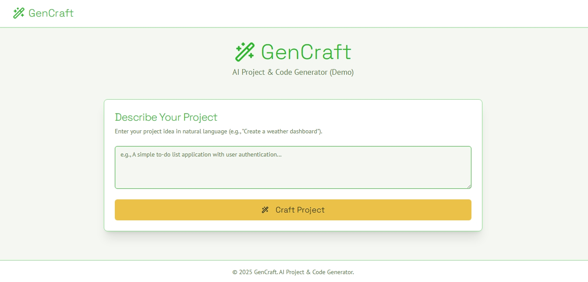
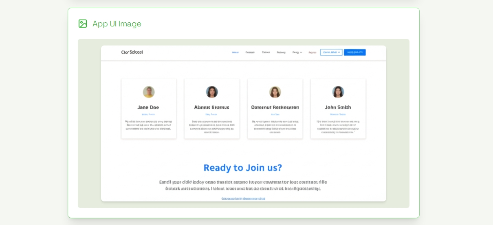

# GenCraft: AI Project & Code Generator

[](https://opensource.org/licenses/MIT)

GenCraft is a Next.js web application It allows users to describe a project idea, and GenCraft will intelligently generate a project plan, provide strategic development advice, scaffold starter React code (multiple files using Next.js App Router, ShadCN UI, Tailwind CSS), create a conceptual UI image based on the generated code, and offer insightful project summaries.

## Demo



#




## Features

*   **AI-Powered Project Ideation to Code:** Transform natural language project ideas into tangible starting points.
*   **Multi-Milestone Project Planning:** Automatically generates a 3-milestone project plan.
*   **Strategic Development Advice:** Receives AI-driven "deep think" advice (key considerations, next steps, potential challenges, long-term thoughts) to guide the initial coding phase.
*   **Multi-File React Code Generation:**
    *   Produces multiple React `.tsx` files, including a main page and necessary sub-components.
    *   Adheres to Next.js App Router conventions.
    *   Utilizes TypeScript for robust code.
    *   Integrates ShadCN UI components for a modern look and feel.
    *   Uses `lucide-react` for icons.
    *   Includes placeholder images (`placehold.co`) with `data-ai-hint` attributes.
*   **Global Style Suggestions:** Provides CSS or Tailwind CSS utility class recommendations.
*   **Conceptual App UI Image:** Generates an image representing a potential UI based on all the generated code.
*   **Project Insights:** Offers an estimated complexity, suggested keywords, and a fun fact or development tip related to the project idea.
*   **Theme Color Suggestions:** Includes an AI flow (`theme-generator-flow.ts`) to suggest color palettes based on project ideas (currently not directly integrated into the main form's generation sequence but available).
*   **Modern & Responsive UI:** Built with Tailwind CSS, ensuring a good experience across devices.
*   **Light/Dark Theme Support:** Adapts to system preferences.

## Tech Stack

*   **Framework:** Next.js 15 (App Router)
*   **Language:** TypeScript
*   **AI Backend:** Genkit (with Google AI - Gemini models)
*   **UI Components:** ShadCN UI
*   **Styling:** Tailwind CSS
*   **State Management:** React Hooks (`useState`)
*   **Fonts:** PT Sans (body), Space Grotesk (headline), Source Code Pro (code)
*   **Deployment:** Configured for Firebase App Hosting (see `apphosting.yaml`)

## Getting Started

Follow these instructions to get a local copy up and running.

### Prerequisites

*   Node.js (v18+ recommended)
*   npm, yarn, or pnpm

### Installation

1.  **Clone the repository:**
    ```bash
    git clone <your-repository-url>
    cd <project-directory-name>
    ```

2.  **Install dependencies:**
    ```bash
    npm install
    # or
    # yarn install
    # or
    # pnpm install
    ```

3.  **Set up Environment Variables:**
    *   Create a `.env` file in the root directory of the project.
    *   Add your Google AI API Key. You can obtain one from [Google AI Studio](https://aistudio.google.com/):
        ```env
        GOOGLE_API_KEY=YOUR_API_KEY_HERE
        ```

4.  **Run Genkit (for AI flows):**
    Open a new terminal window, navigate to the project directory, and run:
    ```bash
    npm run genkit:dev
    ```
    This starts the Genkit development server, which the Next.js application will call for AI functionalities.

5.  **Run the Next.js Development Server:**
    In another terminal window, navigate to the project directory, and run:
    ```bash
    npm run dev
    ```
    This will start the Next.js application, typically on [http://localhost:9002](http://localhost:9002).

## Key AI Flows

The core AI functionalities are implemented as Genkit flows located in `src/ai/flows/`:

*   **`project-plan-generator.ts`**: Takes a project idea and generates a 3-milestone project plan.
*   **`strategic-advice-generator.ts`**: Based on the project idea and plan, provides strategic guidance (key considerations, next steps, challenges, long-term thoughts) to inform the code generation phase.
*   **`react-code-generator.ts`**: Consumes the project idea, plan, and strategic advice to produce multiple React component files (`.tsx`) and global style suggestions.
*   **`image-generator-flow.ts`**: Generates a conceptual UI image based on the concatenated content of all generated React code files.
*   **`project-insights-generator.ts`**: Analyzes the project idea, plan, and a code snippet to provide an estimated complexity, relevant keywords, and a fun fact or development tip.
*   **`theme-generator-flow.ts`**: Suggests a color palette (background, foreground, primary, accent) based on a project idea (this flow is available but not currently wired into the main project generation sequence in the UI).


## License

Distributed under the MIT License. See `LICENSE` (if one exists, otherwise assume MIT or add one) for more information.
```
